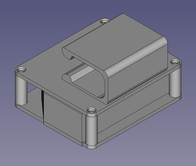
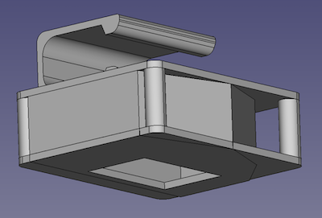

# garage-door-keyfob-holder

## Print Tests
- 9/21/2021
    - PLA, 40% infill, top printed standing up with supports and adhesion
- 9/22/2021
    - PLA, 20% infill, same as 9/21

## Screws
- Brass and Zinc, #6 x 1/2"
- For the threads
    - 1.7mm radius to grab
    - 2.0mm radius not to grab
    - 9.6mm long is safe
- For the beveled head
    - 2.0mm small, 3.5mm big radius
    - 3.4mm between small and big
- For clearing
    - 3.5mm radius, at least 1mm tall